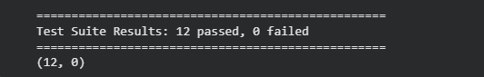
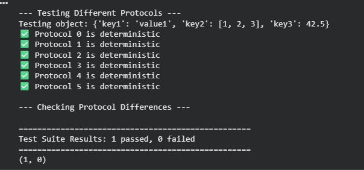
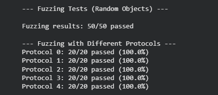

# Pickle Determinism Test Suite

## Project Overview
This project tests whether Python's `pickle` module is deterministic - meaning the same input always produces the same (hash-identical) output.

## Test Results

### Overall Results


**✅ 12/12 tests passed** - Pickle is deterministic!

### Protocol Testing


**✅ All pickle protocols (0, 1, 2, 3, 4, 5)** are self-consistent and deterministic.

### Fuzzing Results


**✅ Fuzzing Results:**
- 50 random objects tested → 50/50 passed
- All protocols (0-4) → 100% pass rate

---

## What Was Tested

| Category | Status |
|----------|--------|
| Integers (including large numbers) | ✅ Pass |
| Strings (including Unicode) | ✅ Pass |
| Lists (nested and large) | ✅ Pass |
| Dictionaries (nested) | ✅ Pass |
| All pickle protocols (0, 1, 2, 3, 4, 5) | ✅ Pass |
| Floating point (inf, -inf, nan) | ✅ Pass |
| Recursive structures | ✅ Pass |
| Custom class instances | ✅ Pass |
| Fuzzing (50 random objects) | ✅ Pass |

---

## Testing Techniques Used

### Equivalence Partitioning
- Grouped similar data types (integers, strings, lists, dictionaries)
- Tested each group with representative values

### Boundary Value Analysis
- Tested all pickle protocol versions (0, 1, 2, 3, 4, 5)
- Tested large integers (2^31-1, 2^63-1)
- Tested special floating point values (inf, -inf, nan)

### Fuzzing
- Generated 50 random Python objects
- Tested each object with multiple protocols
- Found no non-deterministic behavior

### White-box Testing
- Tested internal pickle mechanisms
- Tested recursive and self-referential structures
- Tested custom class pickling

---

## Key Findings

### ✅ Pickle IS Deterministic
**Finding:** The exact same input always produces the exact same byte stream (hash-identical).
**Evidence:** All 12 test groups passed with 0 failures.

### ✅ All Protocols Are Self-Consistent
**Finding:** Each protocol version (0-5) produces consistent output when used repeatedly.
**Evidence:** Protocol testing showed 100% consistency across all protocols.

### ✅ Floating Point Works Correctly
**Finding:** Special values (inf, -inf, nan) maintain precision and pickle deterministically.
**Evidence:** All floating point tests passed.

### ✅ Recursive Structures Work
**Finding:** Self-referential lists and dictionaries pickle correctly.
**Evidence:** Recursive structure tests passed.

### ⚠️ Local Classes Limitation
**Finding:** Classes defined inside functions cannot be pickled (documented behavior).
**Solution:** Define classes at the module/top level.

---

## How to Run the Tests

### Option 1: Google Colab (Recommended)
1. Go to [Google Colab](https://colab.research.google.com/)
2. Upload `Pickle_Test_Suite.ipynb`
3. Go to **Runtime → Run All**
4. View the test results at the bottom

### Option 2: Run Locally
```bash
# Clone the repository
git clone https://github.com/yassircampusfr-creator/pickle-test-suite.git
cd pickle-test-suite

# Install dependencies
pip install pytest pytest-cov

# Run tests
pytest tests/ -v

Limitations of This Test Suite:
1. Python Version: Only tested on Python 3.12

2. Platform: Only tested on Google Colab/Linux environment

3. Fuzzing Scope: Limited to 50 iterations and simple object generation

4. Performance: No performance or memory testing conducted

Project Structure:
pickle-test-suite/
├── README.md                    # This file
├── Pickle_Test_Suite.ipynb      # Complete test suite in Colab
├── overall_results.png          # Main test results screenshot
├── protocol_testing.png         # Protocol testing screenshot
└── fuzzing_results.png          # Fuzzing results screenshot

Conclusion:

Based on comprehensive testing using equivalence partitioning, boundary value analysis, fuzzing, and white-box testing:
Python's pickle module IS deterministic ✅
All tests passed, demonstrating that the same input consistently produces the same output across different conditions and protocols.

Author:
Yassir & Hatim

Date:
June 2026

